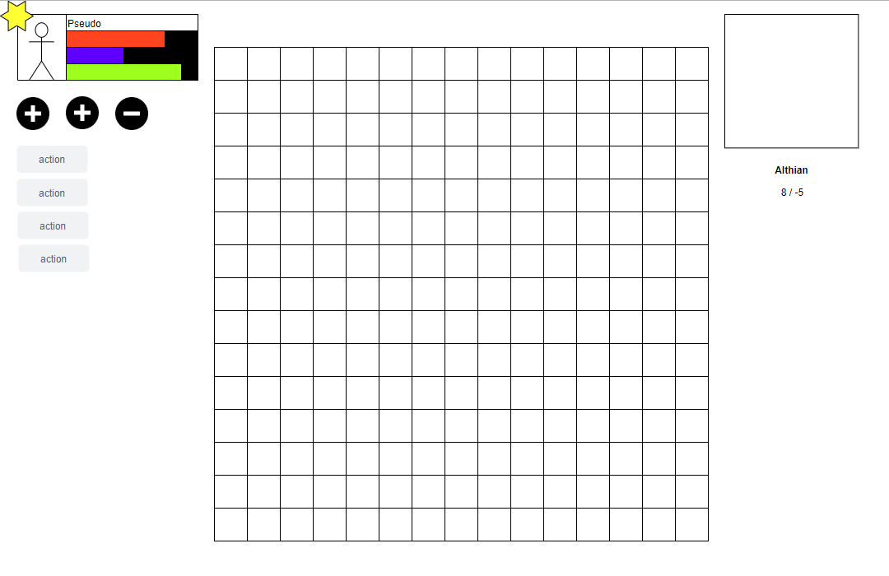
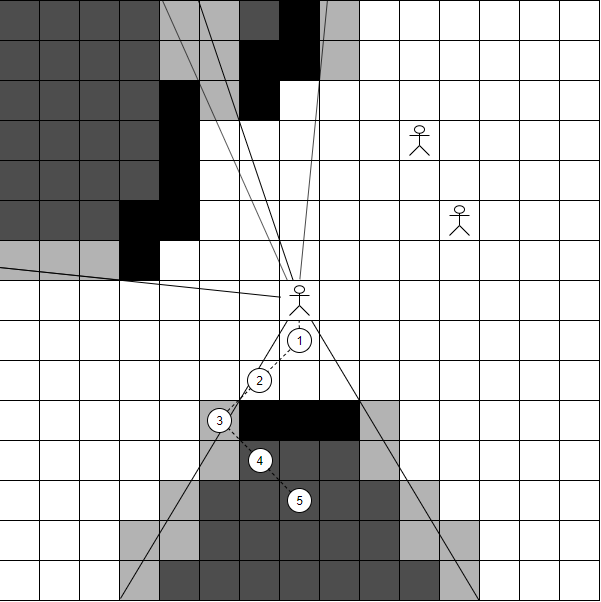
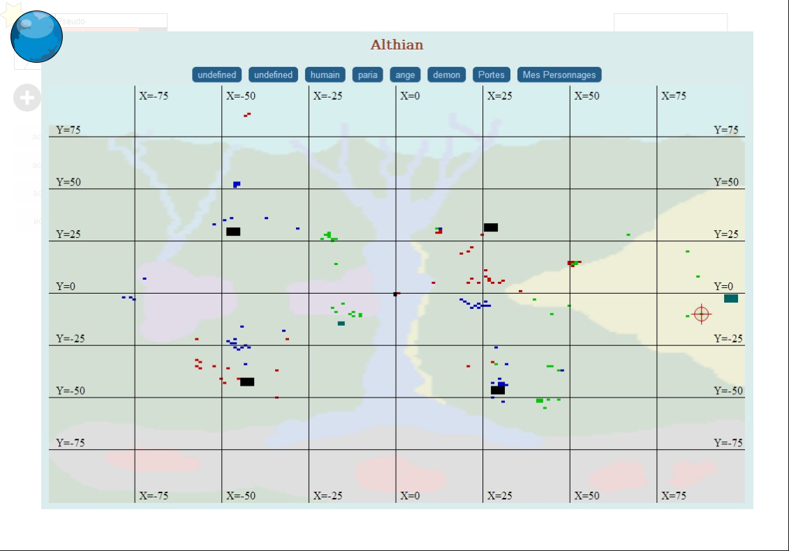

# Interface
## Interface générale
L'interface de jeu se présente ainsi :

### Bar de perso
La boite contenant les informations sur le perso vont indiquer :
* Son pseudo + race (via la couleur de la première ligne)
* Son nombre de HP (en rouge)
* Son nombre de déplacements (en bleu)
* Son nombre de points d'actions (en vert)

On trouve également indiqué le grade via une icone, ainsi que le "portrait" du personnage ou son icone (suivant ce qui sera implémenté)

En dessous de la bar de perso, les buffs / débuffs actif sont affiché sous forme d'icones (différentes couleurs et motifs pour identifier rapidement les buffs et débuffs)

### Actions
Sous cette zone, une liste de boutons est proposé. Il s'agit des actions / actions contextuelles du personnages. Ces actions pourront être : Déplacement, Lancer le sort X, sprinter, etc etc. Les actions contextuelles sont des actions qui seront proposé dans certaines situations. Par exemple, Sprinter sera affiché uniquement quand le personnage n'aura plus de points de mouvements disponibles (0 points, ou X points si une des cases adjacente au persos coute X+1 points pour s'y déplacer)

Une partie des actions peuvent être lancés directement depuis le damier (par exemple attaquer une cible, ou se déplacer sur une case adjacente).

### Damier
Le damier occupe le centre de l'interface, il sera détaillé plus loins

### Radar
Le radar est affiché dans le coins en haut à droite. Il va le contenu de la vue GPS entourant le persos, ainsi que le plan, et la position

## Damier
Le damier représente la grille de jeu.

Les cases en noir correspondent à des cases infranchissables. Leur représentation réelle doit encore être définie

Les cases en gris foncé sont celle recouvertes de brouillard de guerre. Le décors y est visible, mais pas les personnages ou éléments "mobiles"

Les cases en gris clair sont celle en limite du champs de vision. Si un perso est présent dans cette zone, on verra uniquement sa race et son icone, mais pas ces informations

Les traits sont la pour représenter le champs de vision. Il ne seront pas présent en jeu. Par contre, les zones en gris clair pourraient être indiqués non-pas avec une couleur de case, mais avec des traits du même genre

En dessous du perso, il y a une représentation d'un déplacement multiple avec pathfinding : le joueur à placé son curseur sur la position en _5_, et le jeu affiche le chemin le plus court pour y aller, ainsi que le nombre de points de déplacements.

Le jeu n'empêche pas de se déplacer dans une zone inconnue : Si un obstacle ou un joueur est présent en position 4, le personnage avancera simplement jusqu'en position 3. De la même manière, si un personnage invisible est en position 2, le personnage avancera en 1 et sont action sera ensuite interrompue

__Une démonstration du pathfinding + raycasting est disponible avec le lien suivant : [Pathfinder](../demo/pathfinder.html)__

## Radar
Le radar (ou GPS) va afficher ce qui se trouve autour du personnage. Il y a deux modes d'affichage : réduit (en haut de la page de jeu) ou étendu :

Dans cette vue, la page de jeu reste visible par transparence.

La carte actuelle est affiché, avec les perceptions cumulées de tout les persos du camps sur le plan.

Dans le coin, une icone permet de changer de plan (__Althian, Ciféris, etc__) ou de carte (carte __désert__ ou carte __forêt__ du plan __Althian__)

## Fiche de perso
La fiche de perso permet de voir la totalité des statistiques avec le détails des buffs/débuffs, ainsi que l'inventaire (objets équipé et objets dans le sac).

Il y a en outre un lien permettant d'aller à la section d'amélioration du personnage, où il pourra dépenser ses points d'amélioration contre des statistiques ou des talents